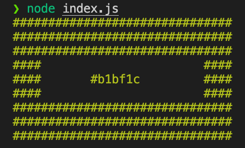
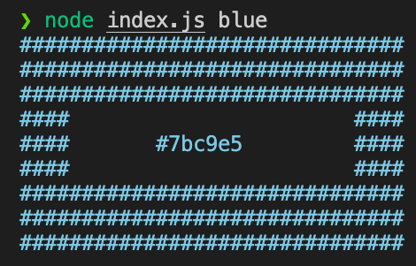

# Random Color Generator

When the program is not run with any input, print a block of approximately 31x9 # characters colored with a random color:

```bash
$ node index.js
```



When a user enters hue (e.g. green or red or blue) and
luminosity (e.g. light or dark), or hue only, the program generates random colors that match those choices:

```bash
$ node index.js light red
```


```bash
$ node index.js blue
```


